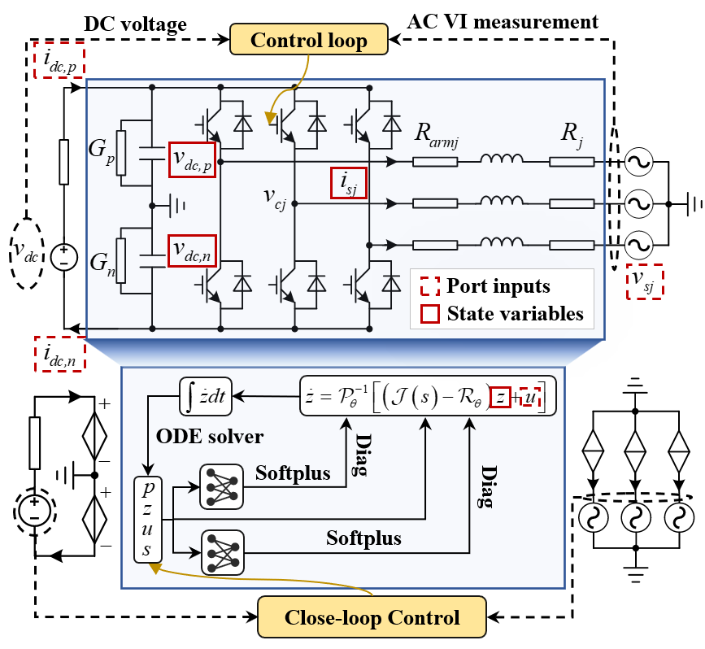

# Port-Hamiltonian Neural Converter

<div align="center">


</div>

## Abstract

<p align="center">
  
  
  
</p>

<p align="center">
  
</p>

Power-electronic-converter dominated grids require electromagnetic transient (EMT) models that are simultaneously fast, accurate, and stable over long rollouts. Conventional detailed IGBT/Diode models provide high fidelity but are expensive for real-time simulation, while switching-function models improve speed at the cost of neglected nonlinear and dissipative dynamics. Pure black-box neural surrogates can learn from data, but they do not preserve converter structure and may accumulate non-physical errors.

This repository provides the implementation of a **physics-priori neural converter** based on **port-Hamiltonian neural ordinary differential equations (pH-NODEs)**. The model preserves the known switching-induced interconnection matrix and learns only uncertain dissipation and parameter mismatch terms. This design improves physical interpretability, enforces positive dissipation through structural parameterization, and supports high-fidelity offline and real-time EMT simulation.

**Our Contribution:**

- **Port-Hamiltonian neural converter** that preserves the known converter interconnection structure.
- **Passivity-oriented formulation** that supports bounded long-horizon EMT rollout.
- **Offline and real-time validation** against detailed IGBT/Diode and switching-function models.
- **Reproducible code and models** for data generation, pH-NODE training, Simulink deployment, and paper-case plotting.

## Environment

### Software Environment

| Component | Version |
| --- | --- |
| MATLAB/Simulink | MATLAB R2018b |
| Python | 3.10.19 |
| PyTorch | 2.9.1+cu128 |
| CUDA | 12.8 |

### Hardware Environment

| Component | Configuration |
| --- | --- |
| Real-time simulator | OP4610XG with AMD Ryzen 3.8 GHz CPU |
| Training GPU | NVIDIA GeForce RTX 5090 |

## Repository Layout

```text
simulink/
  data_generation/      Parallel Simulink data-generation model and script
  offline/              Offline comparison model, initialization, export, and error analysis
  realtime/             Real-time simulation models and initialization files for M1, M2, and M3
training/
  datasets/raw/         Raw data generated by simulink/data_generation (large files are not fully uploaded)
  datasets/processed/   Preprocessed IGBT detailed-model tensors and metadata
  model/                pH-NODE and NODE model definitions
  utils/                ODE integrators, losses, and plotting helpers
  plots/                Open-loop, closed-loop, and HIL result data and figures
  results/              Output directory for inference.py rollout-test results
  checkpoints/          Trained PyTorch network weights
  main.py               Train and run inference from one entry point
  train.py              Supervised rollout training
  inference.py          Long-horizon rollout inference and error reporting
  export_to_sim.py      Export trained PyTorch weights to MATLAB .mat format
```

## Model Definitions

The paper compares three converter models:

- **M1: IGBT/Diode detailed model**. This is the Simscape Universal Bridge reference model and is treated as ground truth.
- **M2: switching-function model**. This uses the ideal switching-function approximation for faster EMT simulation.
- **M3: pH-NODE neural converter**. This keeps the port-Hamiltonian interconnection structure and learns the dissipation matrix and inverse parameter matrix.

The offline Simulink model `simulink/offline/Compare_AI_kk.mdl` contains M1, M2, and M3 for open-loop and closed-loop comparison. The real-time models are separated as `RT_IGBT.slx`, `RT_SWF.slx`, and `RT_AI.slx` under `simulink/realtime/`.

## Simulink Files

`simulink/data_generation/` contains the data-generation workflow:

- `Parim_for_ai.mdl`: Simulink model used for parallel trajectory generation.
- `Parsim_for_ai.m`: MATLAB script that randomizes operating conditions, runs parallel simulations, and saves cleaned raw records.

`simulink/offline/` contains the offline validation workflow:

- `Compare_AI_kk.mdl` and `Compare_AI_kk.slxc`: comparison model for M1, M2, and M3.
- `Net_improve_init.m`: converter and simulation parameter initialization.
- `phnode_weights_3_8.mat`: trained pH-NODE weights used by the Simulink neural converter.
- `Export_result_plot.m`: exports Simulink `out` variables to `.mat` files for plotting.
- `Compare_error.m`: computes RMSE, MAE, NRMSE, and relative RMSE against the IGBT/Diode reference.

`simulink/realtime/` contains the HIL/real-time models:

- `RT_IGBT.slx`: M1 detailed IGBT/Diode model.
- `RT_SWF.slx`: M2 switching-function model.
- `RT_AI.slx`: M3 pH-NODE neural converter.
- `Net_improve_init.m` and `phnode_weights_3_8.mat`: initialization and neural weights needed by the real-time models.

## Data Generation and Datasets

`simulink/data_generation/Parsim_for_ai.m` generates broadband transient trajectories with randomized sinusoidal perturbations applied to active-power reference, reactive-power reference, dc-side voltage, and ac-side voltage. The generated raw `.mat` records should be placed under:

```text
training/datasets/raw/
```

The raw data are large, so the complete raw dataset is not fully uploaded with the repository. Regenerate it with the Simulink data-generation workflow when needed.

`training/datasets/processed/` stores data produced from `raw/` by `training/datasets/preprocess.py`. The released processed data are based on the **IGBT/Diode detailed model (M1)**, not the switching-function model. The preprocessing code also supports switching-function data through `--converter_model Switching`, but the paper training setup uses IGBT detailed-model trajectories.

To regenerate the processed IGBT dataset:

```bash
cd training
python datasets/preprocess.py --data_dir datasets/raw --save_dir datasets/processed --converter_model IGBT --normalization 0
```

Use `--converter_model Switching` only if you intentionally want to build a switching-function dataset.

## Training

Install Python dependencies:

```bash
pip install -r requirements.txt
```

The trained PyTorch weight file is saved in:

```text
training/checkpoints/IGBT_ConverterPHNN_RNonlinearDiag2_Pinvnominal_archmlp.pt
```

Train the pH-NODE model from processed IGBT data:

```bash
cd training
python main.py --converter_model IGBT --converter_neural_model ConverterPHNN --hidden_dim 8 --layers 3 --R_type NonlinearDiag2 --Pinv_type nominal --arch mlp --integrate_method euler
```

The architecture used in the paper is an MLP with input dimension 11, three hidden layers of width 8, and output dimension 5 for the learned dissipation term. Training uses supervised rollout sequences with Euler integration, AdamW, MSE loss, batch size 512, learning rate `3.33e-3`, and loss weights `2.04` for dc capacitor voltages and `1.01` for phase currents.

## Export to Simulink

After training, export the learned PyTorch weights for the Simulink pH-NODE implementation:

```bash
cd training
python export_to_sim.py
```

The repository also includes the MATLAB weight file used by the provided Simulink models:

```text
simulink/offline/phnode_weights_3_8.mat
simulink/realtime/phnode_weights_3_8.mat
```

## Offline Simulation Workflow

1. Open MATLAB/Simulink and add `simulink/offline/` to the MATLAB path.
2. Run `Net_improve_init.m` to initialize converter parameters and simulation settings.
3. Open `Compare_AI_kk.mdl` and run the desired open-loop or closed-loop case.
4. Run `Export_result_plot.m` to save `Y_IGBT.mat`, `Y_pred.mat`, and `Y_SWF.mat` from the Simulink `out` object.
5. Run `Compare_error.m` to compute RMSE, MAE, NRMSE, and relative RMSE for M3 and M2 against M1.

The saved paper-case results are provided under:

```text
training/plots/open_1.0s_ac_1.0_0.8_2.0s_dc_3000_2800/
training/plots/close_1.0s_p_0.8_0.6_2.0s_dc_3000_2800/
```

Each offline case directory contains the exported `.mat` files (`Y_IGBT.mat`, `Y_pred.mat`, `Y_SWF.mat`) and the corresponding SVG figures.

## Real-Time Simulation Workflow

The real-time models correspond to the OPAL-RT/HIL validation in the paper. The test compares 20 us and 40 us real-time steps under dc-voltage and active-power reference changes.

The saved HIL result data and figures are provided under:

```text
training/plots/HIL_1.0s_dc_3000_3200_2.0s_p_0.8_0.6/
```

This directory includes raw HIL exports (`HIL_*.mat`), Python-ready truncated result files (`Y_IGBT_*.mat`, `Y_ai_*.mat`, `Y_swf_*.mat`), and SVG comparison figures for `P`, `Q`, and `vdc` at 20 us and 40 us. The helper script `from_HIL_to_py.m` converts OPAL-RT/HIL exports into the `Y_*.mat` format used by the plotting scripts.

## Inference Results

`training/inference.py` runs long-horizon rollout tests using the trained checkpoint and saves generated figures under:

```text
training/results/
```

This folder is intended for local inference outputs and may be empty in a fresh checkout.

## Notes

- `model/kan.py` from the original training folder is not included because the released experiments use the MLP backbone.
- The uploaded processed dataset is generated from the IGBT/Diode detailed model. Switching-function preprocessing is supported by the code but is not the default dataset used for the paper training results.
- The complete raw trajectory dataset can be very large; regenerate it with `simulink/data_generation/` if it is not present locally.
- Simulink cache/build folders such as `slprj/` are ignored, while selected model/cache files required by the workflows are retained.
